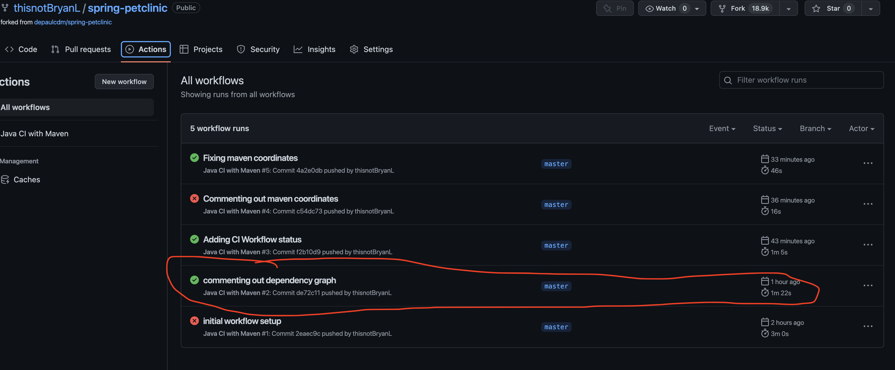
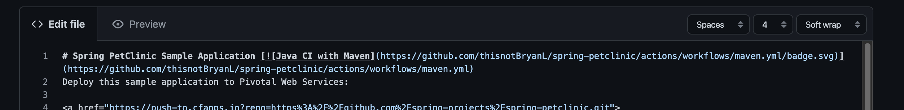
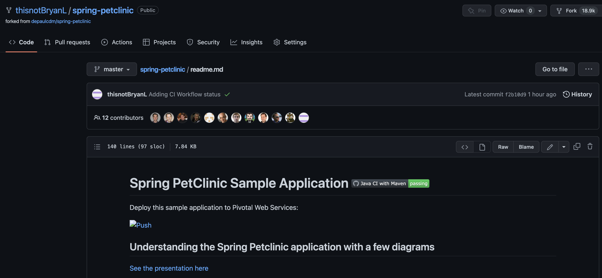
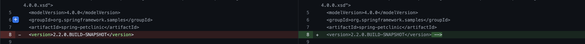
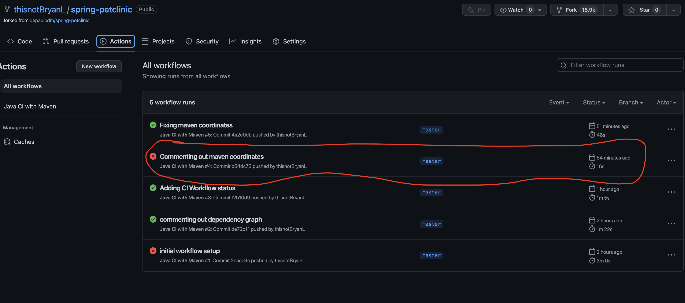
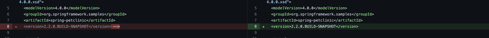
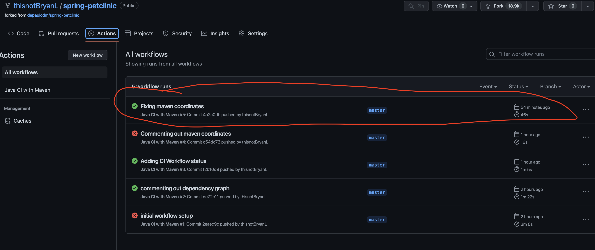
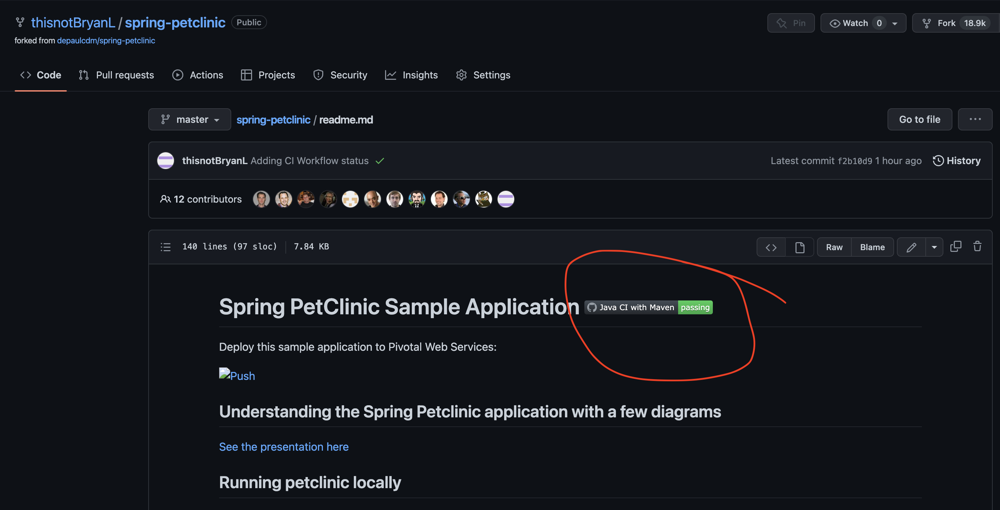

GitHub Actions dashboard showing a successful first build.




GitHub repository with the readme.md file selected showing the code that you changed to update the badge.



GitHub repository with the readme.md file selected showing the build success status after you’ve updated the badge markdown.




The section of the POM file showing the coordinates after you’ve commented them out.




GitHub Actions dashboard showing the unsuccessful build after the breaking change.




GitHub repository with the readme.md file selected showing the build failed status after the GitHub workflow fails.
```
- Was not able to capture this screenshot as I had already moved to fixing the build
```

The section of the POM file showing the coordinates after you’ve fixed them.




GitHub Actions dashboard showing the successful build after the breaking change has been fixed.




GitHub repository with the readme.md file selected showing the build success status after the GitHub workflow has recovered.


